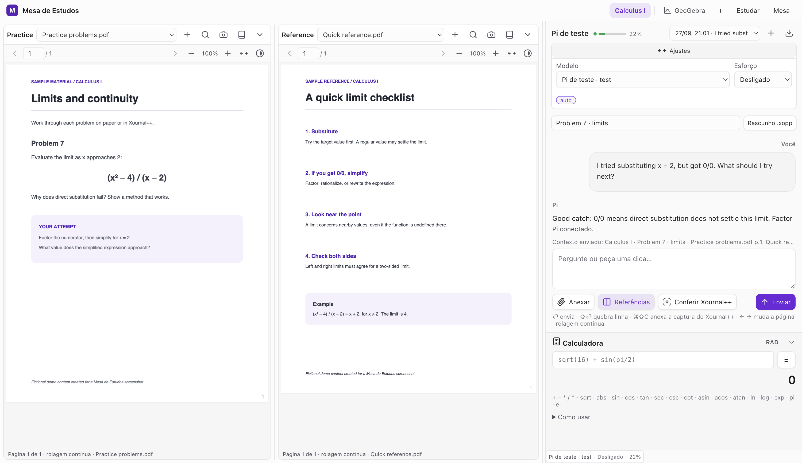
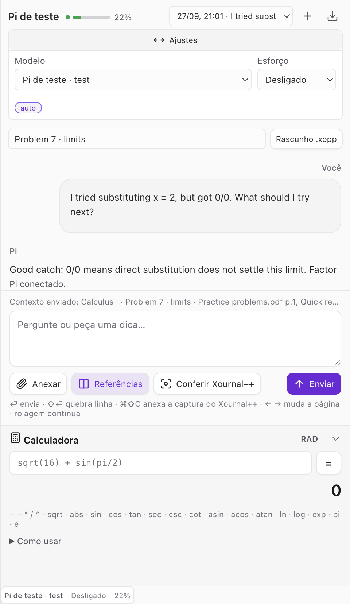
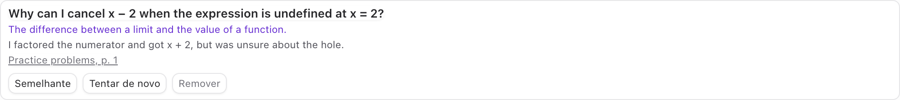

# Mesa de Estudos

**A desktop study desk that keeps the exercise, a reference, and an AI tutor in view while you work things out by hand.**

Mesa de Estudos ("Study Desk") is a local Electron app built around a simple study loop: read a problem, try it in [Xournal++](https://xournalpp.github.io/), ask for help when you need it, and return to the exact page you were reading. The AI conversation runs through [Pi](https://github.com/earendil-works/pi); the PDFs and your study state stay in your local workspace.

**Want the idea without installing anything?** Start with the screenshots and the workflow below. [Leia em português →](README.pt-BR.md)

## The desk

<a href="docs/images/study-workspace.png"></a>

*Click the image to enlarge. This is the actual app with fictional PDFs and a scripted Pi test session. The interface is currently in Portuguese; the panel titles and sample materials here were configured for this demo.*

The left reader holds the exercise. The middle reader holds a formula sheet or another reference. Each PDF has its own navigation, search, zoom, and page position. The conversation on the right knows the active subject, exercise, and open references when you choose to include them. A numeric calculator is available below it.

## The study loop

1. **Keep the source visible.** Put the problem and a reference side by side. The original PDFs are opened read-only.
2. **Make your own attempt.** Write in Xournal++, which stays a separate, full-featured handwriting app.
3. **Ask a specific question.** The active exercise and PDF pages can travel with your prompt. You can explicitly attach a screenshot of the visible Xournal++ window for visual feedback; nothing is captured or sent continuously.
4. **Go back to the material.** A page citation in a Pi answer can open that PDF at the cited page. You can save a difficulty to the review notebook or record where you stopped for the next session.



*In this demo, the tutor points back to `Practice problems.pdf, p. 1`. The screenshot uses a test Pi session, not a claim about any model's accuracy.*

### Save the sticking point

The review notebook keeps a question, your attempt, what was difficult, and a link back to the page. From there you can ask for a similar problem or try again. “End for today” separately saves a local checkpoint with the next step, active exercise, and open pages so you can resume deliberately.



## How it fits together

| Piece | Role |
| --- | --- |
| Mesa de Estudos | Local desktop workspace for PDFs, study context, conversation, review, and a calculator |
| Xournal++ | Handwritten problem solving in a separate window |
| Pi | The AI conversation and model/provider connection; Mesa talks to it through RPC |

There is no Mesa account or app telemetry. Study state and Pi session files are stored locally. **Questions and any images you choose to send go to the provider configured in Pi**, so the AI conversation is not an offline feature.

## Run it locally (optional)

This repository shares the source; the GitHub release does not include a downloadable app installer. You need Node.js **22.19+**, PDFs for a subject, and a Pi provider login or API key. From the repository root:

```sh
cd desk
npm ci
npm run setup
npm run doctor
npm start
```

On first launch, choose a data folder and add a subject with a folder of PDFs. Pi handles provider authentication. See the [setup guide](desk/SETUP.md) for more detail; that guide and the app UI are currently in Portuguese. The source supports macOS and Windows; Xournal++ is optional.

## Project notes

This is a personal, open-source study tool by Lucas Faria. It is designed to sit beside a real writing surface. The source is licensed under [MIT](LICENSE).

If you are building a study app too, I would be especially interested in how you connect a conversation to the student's actual materials and their own attempts. [Questions and feedback are welcome](https://github.com/FariaDev/mesa-de-estudos/issues).
